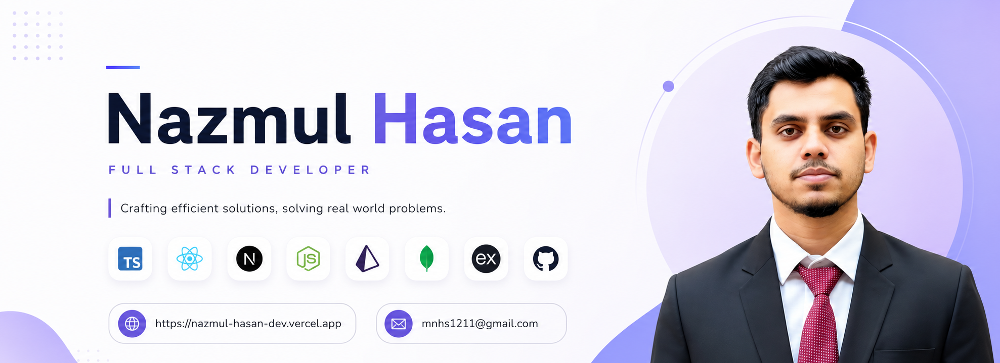

 

  <h1>Hi 👋, I'm Nazmul Hasan</h1>
  
<strong>Software Engineer · Full-Stack Web Developer · Product Builder</strong>

  

    
  

## 👨‍💻 About Me

I'm a software engineer and full-stack web developer who builds useful, scalable web products. I began with WordPress development in 2020 and later moved into modern full-stack development to understand how production web systems work end to end.

- 🔭 I build with **React, Next.js, Node.js, Express, PostgreSQL, MongoDB, and Prisma**.
- 🧠 I care about **performance, SEO, clean UI, usability, and cost-efficient architecture**.
- 🌱 I’m strengthening my backend workflow with **Prisma** and modern database tooling.
- ⚡ I’m building and improving production-ready, SEO-focused web products.
- 💬 Ask me about full-stack web development, CMS work, REST APIs, and shipping products.
- 📍 Based in **Chittagong, Bangladesh**.
- 🌐 Visit my [portfolio](https://nazmul-hasan-dev.vercel.app/) or connect on [LinkedIn](https://linkedin.com/in/mn-hasan).
- 📫 Reach me at [mnhs1211@email.com](mailto:mnhs1211@email.com).

## 🤝 Connect With Me

  
  
  

## 🛠️ Technology Stack

### Languages & Frontend

### Backend, Databases & Services

### Deployment & Cloud

  
  

### Developer Tools & Workflow

### AI, CMS & Additional Platforms

  
  
  
  

## 📌 Featured Projects

- **Cheetahtype** — Typing platform with **2k+ visitors**.
- **GPA Calculator** — SEO-focused SaaS product that ranked #1 on Google, with **10k+ visitors**.
- **TuitionPort** — Full-stack marketplace for tutors and students, serving 30k+ users.
- **Flowditor** — AI automation tool for content publishing.

---

